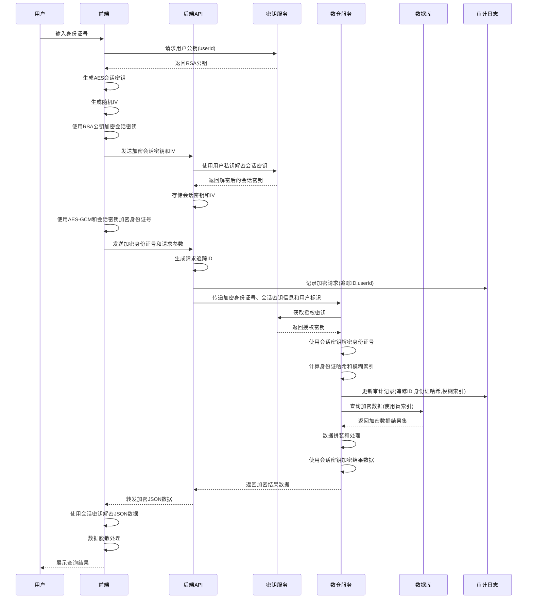
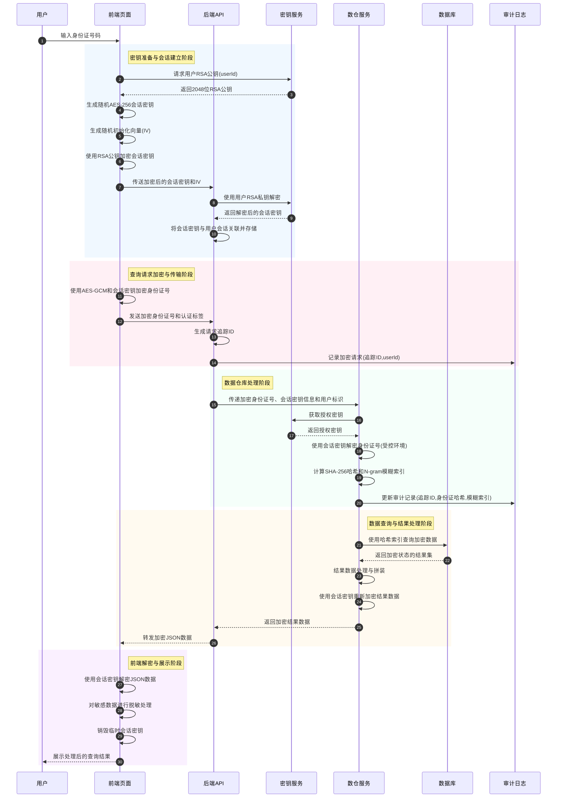

# 全链路安全加密查询系统

## 项目介绍

本项目是一个全链路安全加密的身份信息查询系统，通过前端输入身份证号进行人员信息查询，实现了数据在传输和存储过程中的全程加密保护。系统采用多层加密技术，确保敏感数据在整个处理流程中的安全性。

### 系统特点

- **全链路加密**：从前端到后端，再到数仓和数据库，全程加密传输，不会出现明文
- **用户隔离**：A用户查询的数据，B用户无法查询，确保数据访问安全
- **安全审计**：审计日志中可搜索到查询的身份证，支持合规审计
- **模糊查询**：审计日志中支持对身份证号的模糊查询功能
- **开发隔离**：开发人员无法对密文进行解密，保障数据隐私

## 技术架构

### 前端技术栈

- Vue 3 + Vite
- Element Plus UI组件库
- Axios 网络请求
- crypto-js 加密库
- jsencrypt RSA加密实现

### 后端技术栈

- Spring Boot 2.7.x
- Spring Data JPA
- H2内存数据库（演示用）
- BouncyCastle 加密库

### 安全技术

- RSA非对称加密（密钥交换）
- AES-GCM对称加密（数据加密）
- SHA-256哈希（身份证索引）
- N-gram模糊索引技术

## 系统流程



## 全链路加密流程详解

### 用户输入到结果返回的加解密全流程

整个系统的安全加密查询流程可分为以下几个关键阶段，每个阶段都有严格的加解密处理：

#### 一、密钥准备与会话建立阶段

1. **用户身份识别**：
   - 用户登录系统后，系统识别用户ID
   - 前端根据用户ID向密钥服务请求该用户的RSA公钥
   - 密钥服务返回与该用户关联的RSA公钥（2048位）

2. **会话密钥生成**：
   - 前端生成一个临时的AES-256会话密钥
   - 前端生成随机初始化向量(IV)
   - 这些临时密钥将用于本次查询会话的所有加密通信

3. **会话密钥安全传输**：
   - 前端使用获取到的RSA公钥加密AES会话密钥
   - 前端将加密后的会话密钥和IV发送至后端
   - 后端接收后，使用对应用户的RSA私钥解密，获得会话密钥
   - 后端将会话密钥与当前用户会话关联并临时存储

#### 二、查询请求加密与传输阶段

1. **查询数据加密**：
   - 用户在前端输入身份证号码
   - 前端使用AES-GCM模式和会话密钥对身份证号进行加密
   - 加密后生成密文和认证标签(Tag)

2. **加密数据传输**：
   - 前端将加密后的身份证号和认证标签发送给后端
   - 后端生成请求追踪ID
   - 后端记录加密的请求信息（不解密）到审计日志

#### 三、数据仓库处理阶段

1. **安全数据传递**：
   - 后端API将加密的身份证号、会话密钥信息和用户标识传递给数仓服务
   - 数仓服务从密钥服务获取授权密钥

2. **受控解密处理**：
   - 数仓服务使用会话密钥解密身份证号（受控环境内）
   - 数仓立即计算身份证号的SHA-256哈希值作为索引
   - 同时生成身份证N-gram模糊索引（用于模糊查询支持）

3. **审计记录更新**：
   - 数仓服务将身份证哈希值和模糊索引更新到审计日志
   - 审计日志中从不存储明文身份证号

#### 四、数据查询与结果处理阶段

1. **安全数据查询**：
   - 数仓服务使用身份证哈希值作为索引在数据库中查询
   - 查询返回的是加密状态的个人信息数据

2. **结果数据处理**：
   - 数仓服务对查询结果进行必要的处理和拼装
   - 使用相同的会话密钥和AES-GCM模式重新加密处理后的结果

3. **加密结果传回**：
   - 数仓服务将加密后的结果数据返回给后端API
   - 后端API将加密数据转发给前端

#### 五、前端解密与展示阶段

1. **前端安全解密**：
   - 前端使用本地保存的会话密钥解密JSON数据
   - 解密过程在用户浏览器内完成

2. **数据脱敏展示**：
   - 前端对解密后的敏感数据进行部分脱敏处理（如部分遮蔽身份证号）
   - 将处理后的结果展示给用户

3. **会话密钥销毁**：
   - 查询完成后，前端销毁临时会话密钥
   - 后端在会话过期后清除服务器端存储的会话密钥

### 详细的全链路加密查询安全流程图



### 各阶段加解密技术详解

#### 1. 密钥交换机制

* **RSA非对称加密**：用于密钥交换，确保会话密钥安全传输
  * 密钥长度：2048位，提供强度安全保障
  * 密钥存储：用户私钥在后端安全存储，公钥可分发给前端
  * 使用场景：仅用于加密会话密钥，不用于大量数据加密

* **AES对称加密**：用于实际数据加密
  * 密钥长度：256位，提供高强度加密保护
  * 加密模式：GCM (Galois/Counter Mode)，提供认证加密
  * 特点：除了加密外，还提供完整性验证和认证

#### 2. 数据索引技术

* **哈希索引**：使用SHA-256生成身份证号的哈希值作为索引
  * 特点：单向不可逆，无法从哈希值反推原始身份证号
  * 用途：精确查询使用哈希索引定位数据

* **模糊索引**：使用N-gram技术生成模糊索引
  * 工作原理：将身份证号分解为重叠的n个字符片段
  * 例如：对于"123456"，3-gram生成：[123, 234, 345, 456]
  * 索引存储：对每个片段计算哈希并存储
  * 查询方式：对查询条件同样处理，匹配重叠度超过阈值的结果

#### 3. 审计与安全隔离

* **安全审计机制**：
  * 全流程记录：从请求到响应的完整链路记录
  * 数据隔离：不同用户的数据完全隔离
  * 访问控制：基于用户身份和密钥的严格访问控制

* **环境隔离**：
  * 密钥隔离：用户密钥、会话密钥严格隔离
  * 处理隔离：明文数据仅在受控环境短暂存在
  * 开发隔离：开发人员无法获取解密能力

### 安全特性总结

1. **零信任架构**：系统假设任何环节都可能被攻击，全程加密不信任任何传输环节
2. **最小权限原则**：每个组件只能访问完成任务所需的最小数据集
3. **完全加密存储**：所有敏感数据在存储时均为加密状态
4. **密钥生命周期管理**：会话密钥有严格的生成、使用和销毁流程
5. **不可抵赖性**：所有操作有完整审计日志，支持追溯和审计

## 系统使用指南

### 系统导航

系统包含以下主要页面：

1. **首页**: 系统入口页面，提供查询和审计功能入口
2. **查询页面**: 用于输入身份证号并进行查询
3. **结果页面**: 展示查询结果
4. **审计日志页面**: 用于查看和搜索系统操作记录

### 查询功能使用方法

1. 在系统首页点击"开始查询"按钮或直接访问 `/query` 路径
2. 在查询页面输入身份证号码（如测试号码: 110101199001011234）
3. 点击"查询"按钮，系统将使用加密方式处理您的请求
4. 查询结果将在结果页面展示，敏感信息会进行部分遮蔽

### 审计功能使用指南

系统提供了强大的审计功能，支持多种查询方式，确保操作可追溯性和合规性。

#### 访问审计页面

有以下两种方式可以访问审计日志页面：

1. 在系统首页，点击"审计日志"按钮
2. 直接访问 `/audit` 路径进入审计页面

#### 审计查询方式

审计页面支持以下查询方式：

1. **用户ID查询**：输入用户ID，查询该用户的所有操作记录
2. **身份证号查询**：
   - **精确查询**：输入完整身份证号查找特定记录
   - **模糊查询**：输入部分身份证信息进行模糊匹配
3. **时间范围查询**：选择开始和结束时间，查询指定时间段内的记录
4. **操作类型查询**：按不同操作类型筛选记录（如身份证查询、用户登录等）

#### 查询结果解读

审计查询结果以表格形式展示，包含以下主要信息：

- **追踪ID**：操作的唯一标识符
- **用户ID**：执行操作的用户标识
- **操作类型**：如身份证查询、用户登录等
- **请求/处理时间**：操作的时间信息
- **状态**：操作执行状态（成功/失败/处理中）
- **IP地址**：操作来源IP
- **详情查看**：点击"查看详情"可查看操作的完整信息

#### 审计日志数据保留策略

系统自动清理过期审计日志，默认保留90天。审计数据储存符合相关数据保护法规要求。

## 安全机制说明

1. **会话密钥管理**：每次查询会话生成唯一的AES密钥，使用RSA非对称加密保护传输
2. **身份证加密存储**：身份证号在数据库中以加密形式存储，同时生成哈希索引
3. **模糊索引技术**：使用N-gram技术生成模糊索引，支持对加密数据的模糊查询
4. **全程审计**：系统记录所有查询操作，但审计日志中不保存明文数据
5. **用户隔离**：每个用户拥有独立的密钥对，确保数据隔离

## 项目结构

## 部署与运行

### 环境要求

- JDK 11+
- Node.js 14+
- Maven 3.6+

### 后端服务启动

1. 进入后端目录
```bash
cd backend
```

2. 编译打包
```bash
mvn clean package
```

3. 运行应用
```bash
java -jar target/secure-query-backend-1.0.0.jar
```

后端服务将在 http://localhost:8080 启动，H2数据库控制台可通过 http://localhost:8080/h2-console 访问。

### 前端应用启动

1. 进入前端目录
```bash
cd frontend
```

2. 安装依赖
```bash
npm install
```

3. 开发模式运行
```bash
npm run dev
```

4. 生产环境构建
```bash
npm run build
```

5. 预览生产构建
```bash
npm run preview
```

前端开发服务器将在 http://localhost:3000 启动，已配置API代理到后端服务。

## 测试数据

系统启动后会自动初始化一些测试数据，可使用以下身份证号进行测试：

- 测试身份证1: 110101199001011234
- 测试身份证2: 310101199201022345

## 配置说明

### 后端配置

配置文件位于 `backend/src/main/resources/application.yml`，主要配置项包括：

- 数据库连接信息
- 服务器端口
- RSA密钥大小和缓存时间
- 审计日志保留天数
- 模糊索引配置

### 前端配置

配置文件位于 `frontend/vite.config.js`，主要配置项包括：

- 开发服务器端口
- API代理设置
- 路径别名

## 常见问题解答

1. **Q: 如何修改审计日志的保留时间？**  
   A: 在后端配置文件中修改 `audit.retention-days` 配置项

2. **Q: 系统是否支持批量查询？**  
   A: 当前版本不支持批量查询，为保证安全性，仅支持单条查询

3. **Q: 模糊查询的原理是什么？**  
   A: 系统采用N-gram算法创建模糊索引，可在不解密的情况下进行相似性查询

4. **Q: 如何扩展支持更多类型的查询？**  
   A: 请参考开发文档中的"新增查询类型"章节进行扩展

## 安全注意事项

1. 生产环境部署时，请更换RSA密钥对
2. 建议使用HTTPS协议保护前后端通信
3. 定期轮换系统使用的密钥
4. 生产环境中应使用专业的密钥管理系统
5. 定期审计系统日志，检查异常访问

## 许可证

本项目采用 MIT 许可证