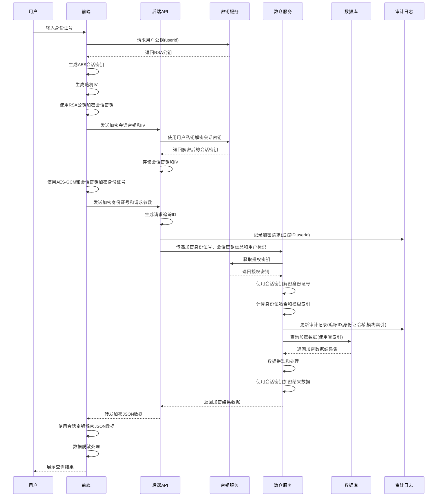

你是Java高级架构师，要实现对Java项目的全链路安全加密，场景是前端输入身份证号进行人员信息查询，后端进行参数传递向数仓，数仓进行数据拼装，然后返回后端，后端将数据组装返回前端json串，目标是：1、全链路中不能出现明文，包含前端参数透传，后端参数透传，数仓参数透传，数据库入库为加密，开发人员也无法对密文进行解密；2、a用户查询的数据，b用户无法查询；3、审计日志中可查看到查询的身份证，4、审计日志中支持对身份证号的模糊查询功能

流程图
